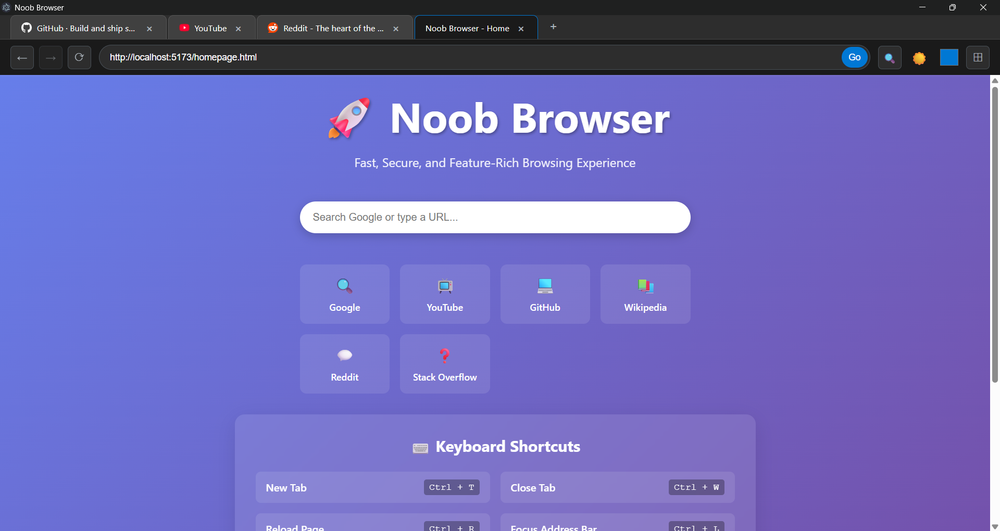
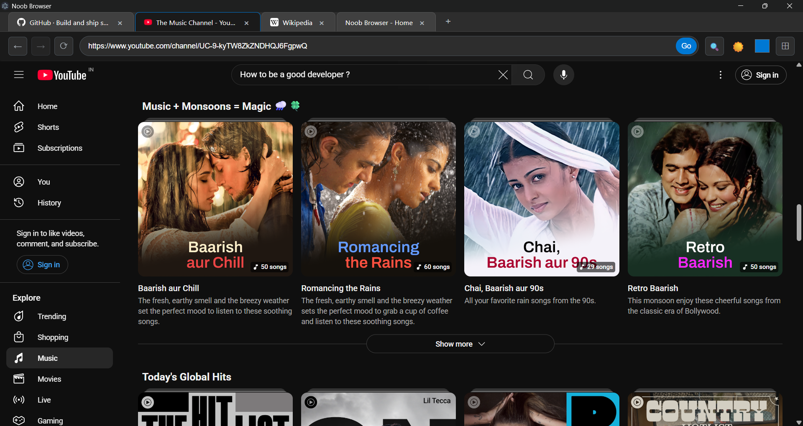

# 🧑‍💻 Noob Browser

<i>Because the world definitely needed another browser.</i>

[](https://github.com/Adamya-Gupta/Noob-Browser/blob/main/LICENSE)

<div align="center">
</table align="center">
<tr>
<td >

</td>
<td>

</td>
<td>

</td>
</table>
</div>


## 💡Motivation 
This magnificent creation exists solely because I decided to explore ElectronJS and had a bit too much free time.<br>
Please don’t take this seriously—I certainly don’t. The only reason you’re seeing this documentation is because I was too bored to scroll Instagram.<br>
**Fun fact:** I’m writing this README while listening to songs on YouTube in this very browser.😎

## 📸 Screenshots
Just imagine what a browser looks like... yeah, it’s like that.<br>
I added screenshots so you don’t have to suffer by actually running the project:
<div align="center">
<table width="1000" >
<tr>
<td align="center">

</td>
<td align="center">

</td>
</tr>
</table>
</div>

## 📌 Features
Oh, you're in for a treat. Look at all these completely groundbreaking features:
- Multiple tabs AND multiple windows (yes, like it's 2005).
- Tab data gets saved in `localStorage` (wow, persistence!).
- Supports your very average keyboard shortcuts.
- It can do most of what a browser does, just... not particularly well.

## 🛠️ Tech Stack
Built with the power of:
- HTML (shockingly still relevant)
- CSS (sprinkled in, like parsley)
- JavaScript (obviously)
- [Electron Forge](https://www.electronforge.io/) (aka the "turn websites into apps" toolbox)
- Vite (because waiting for builds is too mainstream)

>[!NOTE]
>Yes, this could've been done with better tech and actual optimization... but we’re not aiming for Google Chrome here, are we?

## ⚙️Installation & Setup

>[!Warning]
>Think twice. Then maybe don’t. <br>
>But if you're feeling brave—or dangerously bored—go ahead:

### Step 1: Clone the Repository

```bash
git clone https://github.com/Adamya-Gupta/Noob-Browser.git
```

### Step 2: Install Required Dependencies

```bash
cd Noob-Browser
npm install
```

### Step 3: Launch the Beast
```bash
npm start
```
Now enjoy your browser experience (just don’t expect miracles).

## 🚀 Future Improvements
- Maybe build a browser that’s actually, you know, usable.
- Polish the UI with some modern fairy dust.
- Fix bugs... someday... probably... maybe not.

## 🤷 Disclaimer
This project is for educational chaos only. Use at your own risk. Side effects may include eye rolling and developer cringe.

